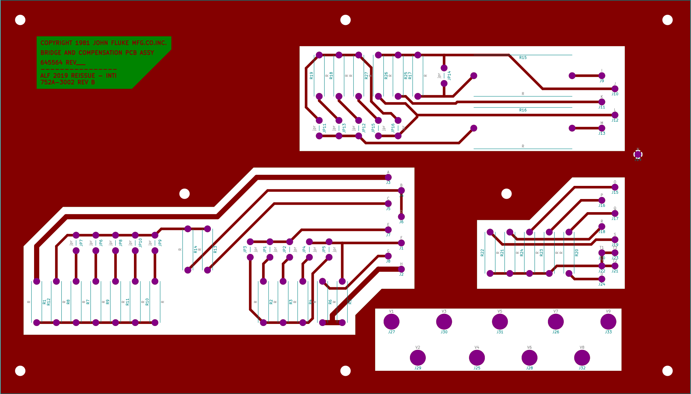

# fluke752a-pcb

This repository contains a [KiCad](http://kicad-pcb.org/) project with the board 752A-3002 REV B for the Fluke 752A resistor bridge. In [this link](export/fluke_752A_pcb.pdf) you can find the schematic and below is the layout of the board.

